# Worksheet 1

## Task 1

For task 1, I implemented a basic string class using the interface provided in the worksheet, which I declared in 'my_string.hpp':

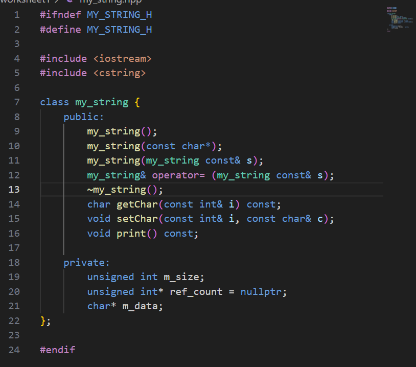

In addition to the provided function signatures, I declared some class variables as part of my implementation:
- `m_size` is used to hold the size of the string
- `m_data` is a char pointer to point to and access the data

These functions are then defined in `task1.cpp`.

*More detail here...

## Task 2

For this, I extended my string class shown in task 1 to support automatic reference counting. This is a memory management technique which tracks how many references exist to an object and frees it when it is no longer needed. The flaw with the implementation of the previous task being that `m_data` is never freed and there is no way of tracking when multiple references exist to this data.

I implemented reference counting by:
- Creating a pointer to an unsigned integer, which is initialized to zero or one in the constructor:
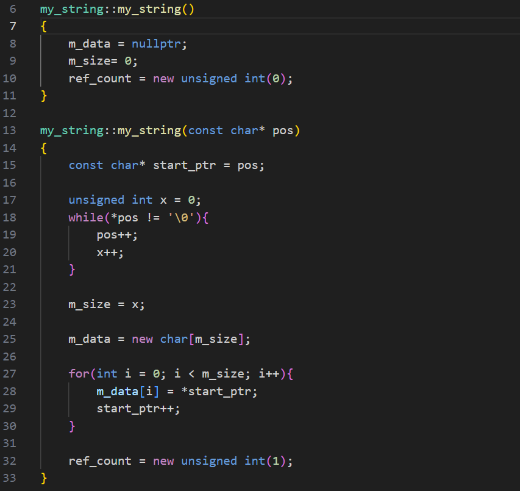
- In the function overloading the assignment operator and copy constructor:
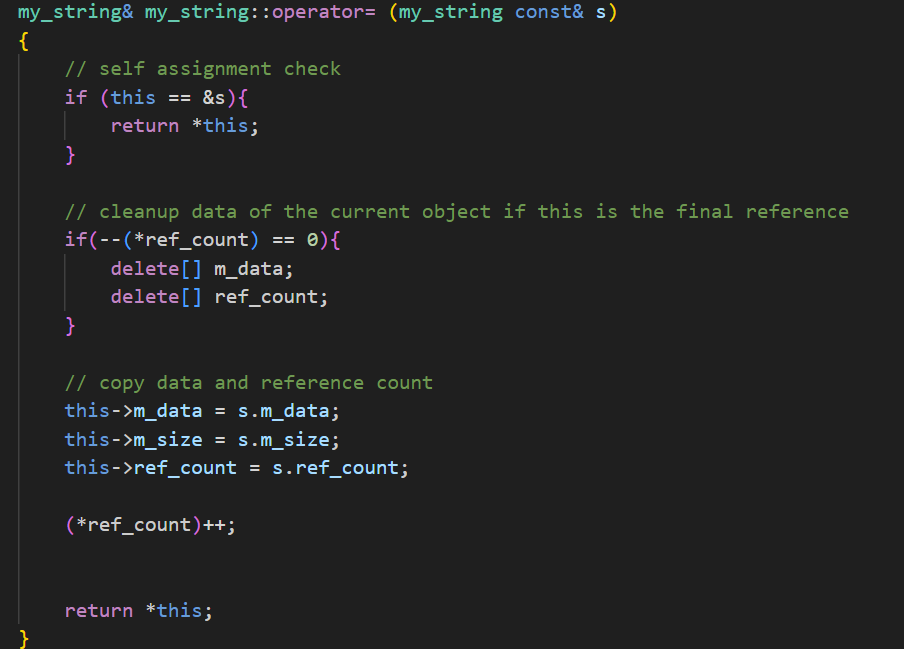
I first decrement and check whether the current object has reached a reference count of zero. This means that the data from the current object is cleaned up before pointing to `s`.
Then the reference count is copied to point to the same memory of the object `s` and incremented. 
- In the destructor, the reference count is decremented and memory only freed if the count reaches zero.

I tested this with the same code from task one but extended the `print` function to print the count. This achieved the desired results as shown on the worksheet.

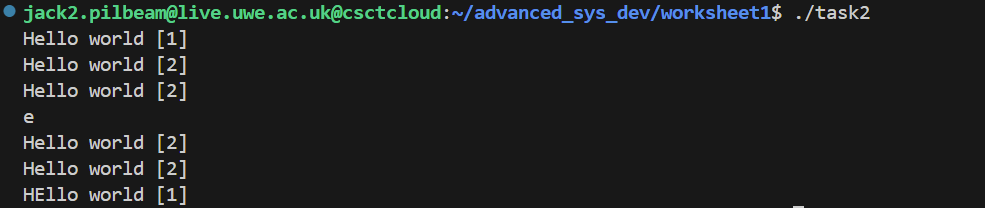

## Task 3

To demonstrate the reference count reaching zero, I wrote the below code:

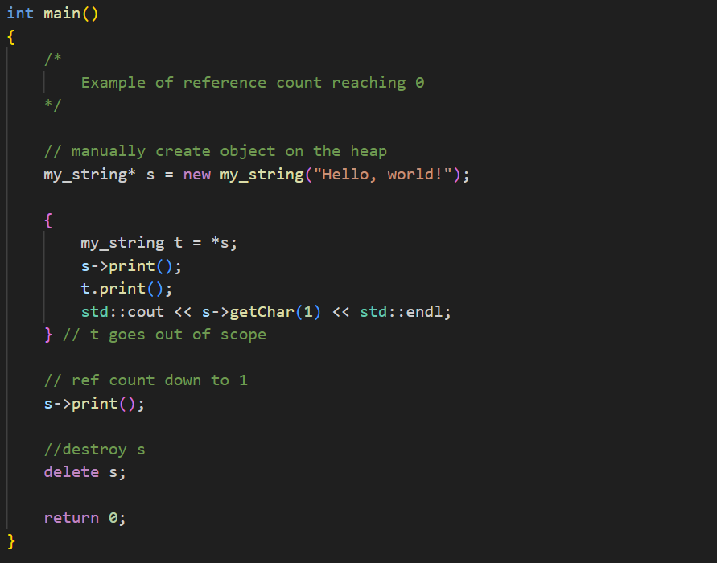

This creates a new `my_string` object on the heap. Then inside a new block scope, define `t` to point to `s` - this increases the reference coun. At the end of the block scope `t` goes out of scope and the count is decremented. Then `s` is manually deleted, which triggers a print statement in the destructor:

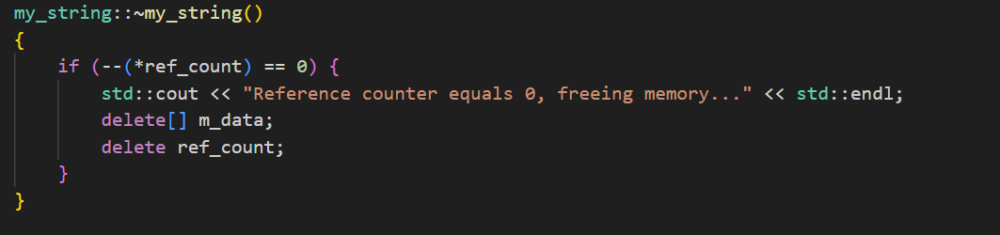

The output of this program is:

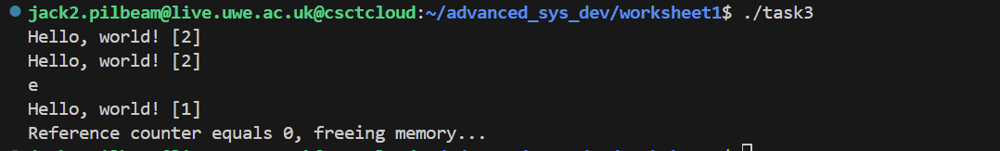

## Task 4

To implement the reference counter as it's own class, I created `reference_counter.hpp` and defined a template class:

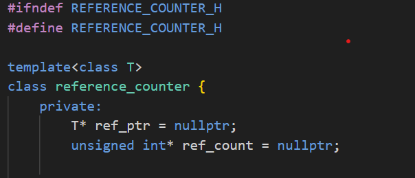

- `T* ref_ptr` is used to point to the provided data of type `T`. This allows it to work for any type.
- `ref_count` functions the same as the implementation above.

To have multiple references to the same data, I created a copy constructor as below:

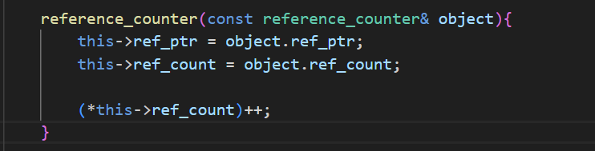

Which points the above class variables to that of the `reference_counter` object being passed in and increments the count. 

I also overloaded the arrow operator (`->`) to return the underlying data the reference counter is pointing to:

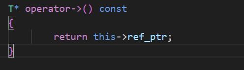
Which allows you to call member functions if the pointer points to an object. 

Similarly, I overload the dereference pointer to return the dereferenced `ref_ptr`:

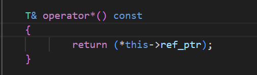

The destructor of this class functions the same as the string class in task 2. 

My test code for this can be found in `task4.cpp`. This goes through creating multiple reference count objects to point to the same resource and demonstrates the functionality as discussed above. The output is:

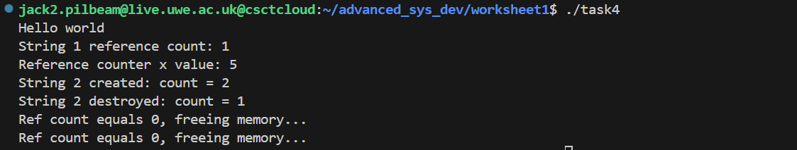

Please note that the two print statements are from the reference counter objects going out of scope at the end of `main()`.

